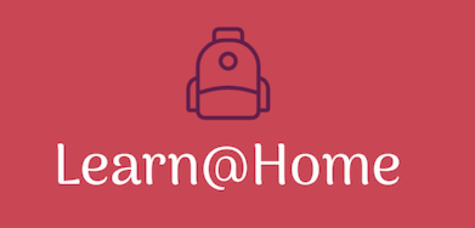

### Projet 10 - Définissez les besoins pour une app de soutien scolaire

### Fonction
Lead développeur

### Concept:
Association qui propose du soutien scolaire à distance grâce à des tuteurs bénévoles pour les élèves en difficulté scolaire.

### Objectif
Concevoir un site web pour Learn@Home afin que les élèves et les bénévoles puissent communiquer facilement sur le site, peu importe où ils se trouvent.

### Fonctionnalité
* Connexion : permettre aux élèves et aux bénévoles de se connecter au site web.
* Chat : permettre aux élèves et aux bénévoles de communiquer en temps réel.
* Calendrier : permettre aux bénévoles et aux élèves de planifier des sessions de soutien scolaire.
* Gestionnaire de tâches : permettre aux bénévoles de donner des tâches à accomplir aux élèves et de suivre leur progression.
* Tableau de bord : permettre aux bénévoles de voir les informations importantes telles que les élèves à charge et les sessions de soutien scolaire planifiées.

### Attente client
Définir les besoins client
1. Diagrammes de cas d’usage pour chacune des fonctionnalités (connexion, chat, calendrier, gestionnaire de tâches, tableau de bord)
2. User stories avec critère(s) d’acceptation pour chacune des fonctionnalités, partagées dans un format standard (PDF, DOCX, XLSX)
3. Maquettes du site avec un design simple et au moins une maquette par page
4. Kanban découpant le projet, de manière macro (détails techniques exclus) en blocs de fonctionnalités et sous-fonctionnalités pour le développement. J’ai démarré le découpage dans ce kanban sur Notion, à toi de finir de compléter la colonne ”ANALYZE” sur le même modèle

### Contraintes techniques
- [Respect des attentes du client](https://s3-eu-west-1.amazonaws.com/course.oc-static.com/projects/Front-End+V2/P8+-+Gestion+de+projet/Notes+-+Re%CC%81union+Learn%40Home.pdf)
- [Fournir les maquettes pour desktop et mobile](https://www.figma.com/files/recent?fuid=946156100518205974)
- [Respect et développements du Kanban](https://www.notion.so/Dev4U-projet-Learn-Home-972828849f7947289c23756d323a6335)

### Livrable
- Les diagrammes de cas d’usage, pour chacune des fonctionnalités majeures de chaque page
- Les user stories, avec critère(s) d’acceptation pour chacune des fonctionnalités (PDF, DOCX, XLSX).
- Les maquettes du site, avec un design simple et au moins une maquette par page
- Un document TXT contenant le lien vers le tableau Kanban (Notion, Trello, or GitHub)

### Technlogies
[Figma](https://www.figma.com/files/recent?fuid=946156100518205974) ou [Sketch](https://www.sketch.com/)
